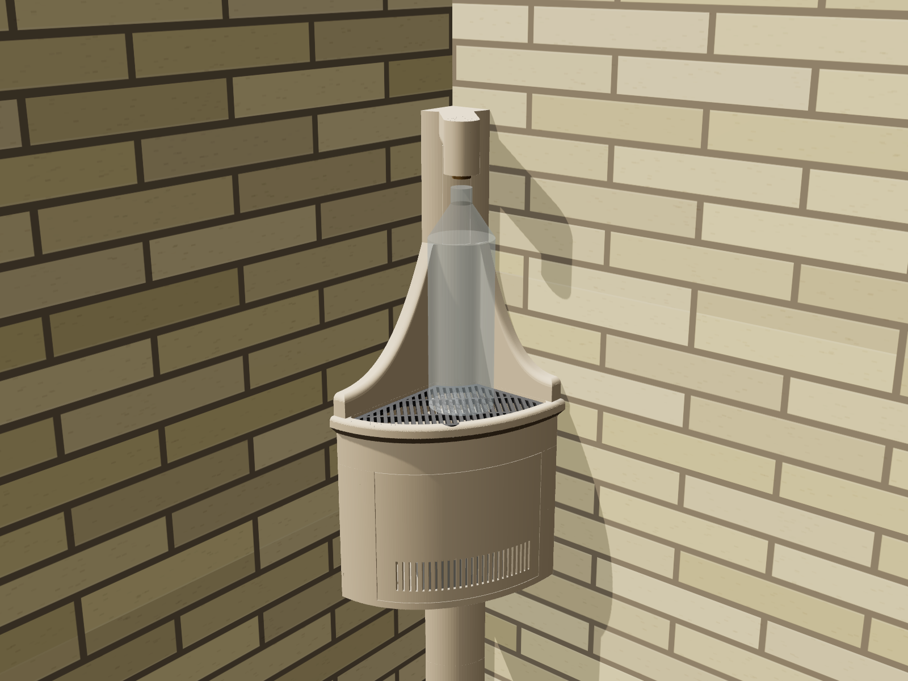
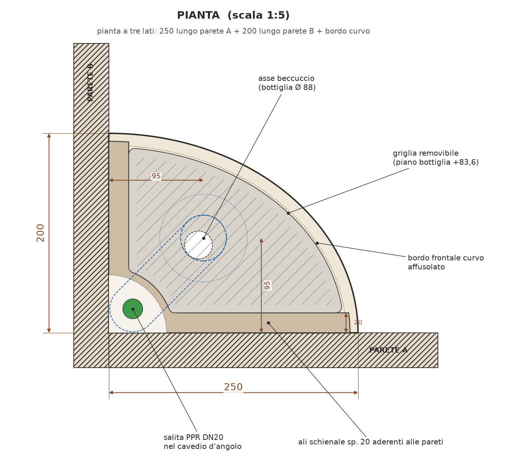
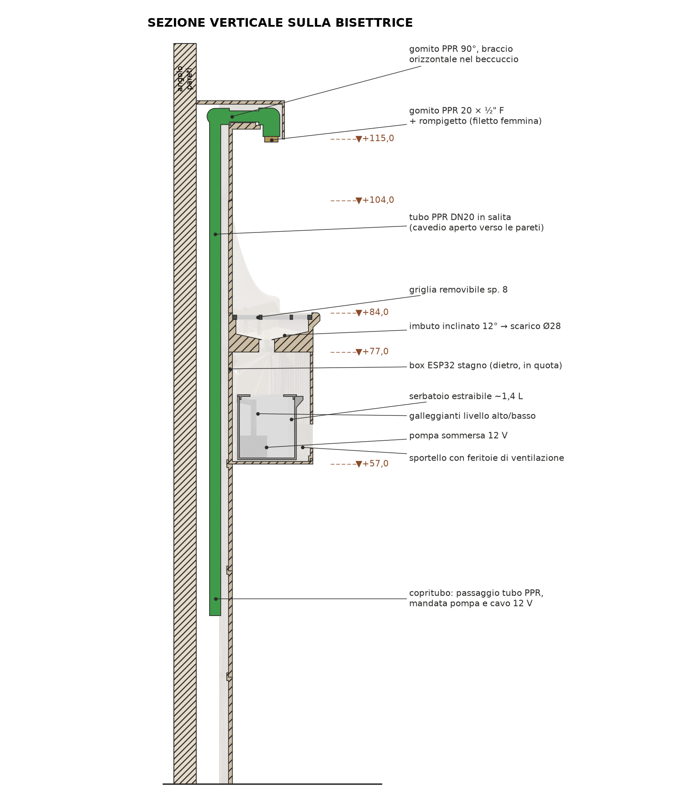
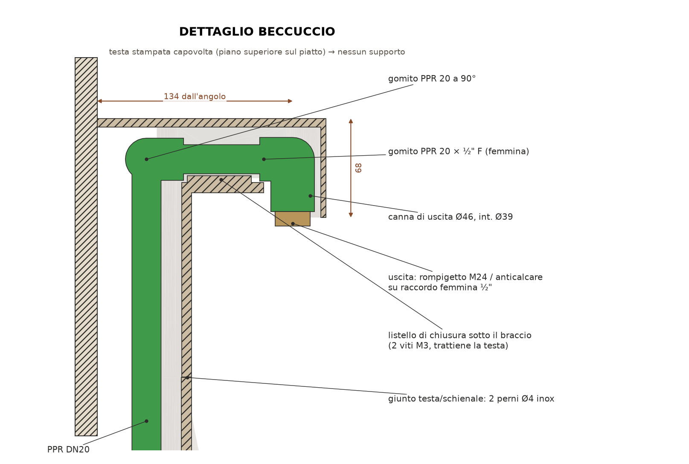

# Fontanella d'angolo per riempimento bottiglie — stampabile in 3D (ASA, Bambu Lab P2S)



Piccola fontanella da esterno da fissare nell'angolo interno di due pareti in mattoni. Serve solo a
riempire bottiglie. La pianta ha **esattamente tre lati**: **250 mm** lungo la parete A, **200 mm**
lungo la parete B (entrambi partono dall'angolo) e un bordo frontale curvo e affusolato.
Sotto il piano c'è un vano tecnico con serbatoio estraibile, pompa sommersa 12 V, galleggianti e un
box stagno per l'ESP32.

Tutta la geometria è **parametrica** (`cad/params.py`) e viene generata da `cad/fontanella.py`.
Ogni pezzo stampato sta entro **250 × 250 × 250 mm**. Il generatore controlla da solo questo limite,
la tenuta stagna delle mesh e le interferenze tra i pezzi e con il tubo PPR.

| Elaborato | File |
|---|---|
| Tavola completa (6 viste: ambientata, pianta, prospetto, sezione, esploso, dettaglio) | [`docs/tavola_progetto.pdf`](docs/tavola_progetto.pdf) · [`.png`](docs/tavola_progetto.png) |
| Visualizzatore 3D interattivo (apri nel browser) | [`docs/viewer.html`](docs/viewer.html) |
| STL pronti per la stampa (già orientati) | [`stl/print/`](stl/print) |
| STL in posizione di montaggio | [`stl/assembly/`](stl/assembly) |
| Firmware ESP32 | [`firmware/fontanella_esp32/`](firmware/fontanella_esp32) |

| Pianta | Sezione | Dettaglio beccuccio |
|---|---|---|
|  |  |  |

---

## 1. Geometria e quote

Riferimento: origine nello spigolo delle pareti, a livello del pavimento. X lungo la parete A,
Y lungo la parete B, Z verso l'alto.

| Elemento | Quota |
|---|---|
| Pianta | 250 (parete A) × 200 (parete B), bordo frontale a quarto d'ellisse |
| Piano vasca (bordo) | **+840** dal pavimento |
| Piano griglia (appoggio bottiglia) | +836 |
| Uscita beccuccio | **+1150** (luce libera 314 mm sopra la griglia: entra una bottiglia da 1,5 L in piedi) |
| Asse beccuccio | 95 mm da entrambe le pareti, cioè vicino all'angolo |
| Sommità testa | +1218 |
| Vano tecnico | da +570 a +770 |
| Copritubo d'angolo (opzionale) | da 0 a +570, 3 moduli |

**Vincoli rispettati**
- La vasca aderisce alle due pareti. I due lati rettilinei partono dallo stesso spigolo e non c'è spazio tra lavabo e angolo.
- La pianta ha 3 lati: 250 + 200 + bordo curvo.
- Il beccuccio è vicino allo stesso angolo, non al centro dello schienale.
- Nessun pezzo stampato supera 250 mm in X, Y o Z.
- Lo schienale (colonna d'angolo cava + ali a onda) nasconde tutta la salita PPR, comprese le due curve.

> **Angolo tra le pareti.** Il modello assume pareti a **90°**: lo dicono il testo e la foto, e lo
> conferma lo schizzo SketchUp, dove gli assi rosso e verde sono ortogonali. Se l'angolo reale fosse
> diverso (per esempio 45° come accennato), va adattato `cad/fontanella.py`: la pianta usa il primo
> quadrante.

## 2. Pezzi da stampare

| # | Pezzo | Ingombro di stampa (mm) | Colore | Orientamento |
|---|---|---|---|---|
| 01 | Vasca (piano, bordo affusolato, sede griglia, imbuto) | 250 × 200 × 74 | sabbia | diritta |
| 02 | Griglia removibile | 212 × 164 × 8 | antracite | piatta |
| 03 | Schienale (ali a onda + colonna cava) | 242 × 192 × 200 | sabbia | diritto |
| 04 | Testa con beccuccio | 118 × 118 × 178 | sabbia | **capovolta** (faccia superiore piatta sul piatto) |
| 05 | Listello di chiusura a L (sotto il braccio) | 67 × 67 × 138 | sabbia | capovolto |
| 06 | Corpo vano tecnico | 238 × 188 × 206 | sabbia | diritto |
| 07 | Sportello curvo con feritoie | 195 × 131 × 194 | sabbia | capovolto, in piedi |
| 08 | Serbatoio estraibile (~1,4 L) | 152 × 150 × 113 | qualsiasi | diritto |
| 09 | Coperchio serbatoio | 152 × 150 × 9 | qualsiasi | capovolto |
| 10 | Box elettronica stagno | 100 × 52 × 48 | antracite | sul dorso |
| 11 | Coperchio box | 100 × 52 × 3 | antracite | piatto |
| 12–14 | Copritubo d'angolo (opzionale) | 65 × 65 × 198 | sabbia | diritti |

Gli STL in `stl/print/` sono già orientati e appoggiati sul piatto. La vasca occupa 250 mm sul piatto
da 256 mm della P2S: centrala bene e usa un brim solo sui lati corti.

**Impostazioni consigliate per l'ASA su P2S**
- Ugello 0,4, layer 0,2 (0,16 per testa e listello), camera chiusa, piatto a 100 °C, ugello 255–265 °C.
- 4 perimetri (5 per vasca e serbatoio), 5 layer superiori e inferiori, infill gyroid 15 % (25 % per la testa).
- Nessun supporto. Tutte le sporgenze sono a 45° o in ponte breve. La testa va stampata capovolta.
- Per pezzi grandi (vasca, schienale, corpo) usa un brim di 5 mm e niente ventola nei primi layer, per limitare il warping dell'ASA.
- **Impermeabilizzazione**: l'ASA stampato non è stagno al 100 %. Stendi una mano di resina
  epossidica trasparente (o vernice poliuretanica bicomponente) sull'imbuto della vasca e
  dentro il serbatoio. Il resto può restare grezzo.

## 3. Materiali da acquistare

**Idraulica** (acqua potabile: solo tubo e raccordi certificati, nessun canale stampato)
- Tubo PPR DN20 PN20 per la salita e il braccio, circa 1 m.
- 1 gomito PPR 20 a 90° in cima alla salita.
- 1 gomito PPR 20 × ½" F, cioè con filetto femmina in ottone: è il terminale del beccuccio, rivolto verso il basso.
- 1 rompigetto o anticalcare con adattatore ½" M → M24 (o M22), da avvitare nel raccordo femmina.
- Raccordi di collegamento al miscelatore esistente.

**Viteria (inox A2)**
- 4 inserti a caldo M4 + 4 viti M4×20: corpo → vasca, dalle linguette interne.
- 4 inserti a caldo M4 + 4 viti M4×25: vasca → schienale, avvitate da sotto la vasca.
- 2 inserti a caldo M3 + 2 viti M3×10 svasate: listello sotto il braccio.
- 4 inserti a caldo M3 + 4 viti M3×10: coperchio del box.
- 2 perni inox Ø4×18: giunto testa/schienale.
- 6 viti 5×60 con tasselli da 8 mm per i mattoni (corpo a muro) + 2 viti 4,5×60 con tasselli da 6 (box + corpo a muro).
- 2 magneti al neodimio 6×3 nello sportello + 2 nella vasca, sotto.
- Silicone neutro per esterni e striscia EPDM adesiva 3×6 per il coperchio del box.

**Elettronica**
- ESP32 DevKit (o ESP32-C3 SuperMini).
- Pompa sommersa 12 V DC brushless (circa 45×40×40 mm, 3–5 W) + tubo di mandata Ø 8/10.
- 2 galleggianti verticali con filetto M10: livello alto e livello basso.
- MOSFET logic-level (modulo AO3400 o IRLZ44N) + diodo 1N5819 (o 1N4007) in parallelo alla pompa.
- Convertitore buck 12 → 5 V (Mini560 o LM2596).
- Alimentatore 12 V 1 A (SELV), da tenere in casa o in contenitore IP65, con fusibile da 1 A sulla linea 12 V.
- 2 pressacavi PG7 sul fondo del box.

## 4. Sequenza di montaggio

1. **Tracciamento.** Segna l'angolo e le quote +570 (fondo del vano) e +840 (piano). Controlla la squadra delle pareti.
2. **Tubo PPR.** Porta la salita PPR nell'angolo, con l'asse a 24 mm da ciascuna parete. A **+1190** salda il gomito a 90° orientato sulla bisettrice. Aggiungi circa 70 mm di tubo orizzontale e il gomito 20 × ½" F rivolto verso il basso, con l'asse a 95/95 mm dalle pareti. La faccia del raccordo deve stare a circa +1154. Fai la prova di pressione **prima** di rivestire.
3. **Copritubo (opzionale).** Impila i 3 moduli intorno al tubo. Accorcia quello in basso se serve, e apri una finestra dove entra il tubo dal miscelatore.
4. **Corpo.** Infilalo in diagonale, con il tubo che entra nel cavedio aperto sul retro, e abbassalo sull'innesto del copritubo. Mettilo in bolla e fissalo con 6 viti nei mattoni.
5. **Box elettronica.** Fissalo all'interno della parete A con 2 viti passanti nel corpo e nel muro, sigillando i fori. Passa i cavi nei pressacavi sul fondo.
6. **Vasca + schienale.** Uniscili al banco con 4 viti M4 da sotto e un cordolo di silicone sulla cresta anti-infiltrazione. Infila il gruppo in diagonale sotto il braccio del beccuccio, abbassalo sull'anello di centraggio del corpo e fissalo con 4 viti M4 dalle linguette interne.
7. **Testa.** Calala **dall'alto** sul tubo: colonna, braccio e canna di uscita sono aperti in basso. Centrala sui 2 perni Ø4.
8. **Listello a L.** Chiude la feritoia della colonna e il canale sotto il braccio. Si fissa con 2 viti M3 e blocca la testa sul tubo, così non si può sfilare verso l'alto.
9. **Rompigetto.** Avvitalo nel raccordo femmina ½".
10. **Silicone.** Stendi un cordolo neutro tra schienale e mattoni e lungo i bordi della vasca contro le pareti.
11. **Vano tecnico.** Inserisci il serbatoio con pompa e galleggianti. Mandata e cavi escono dalla tacca sul retro e passano nel cavedio attraverso i due fori della parete curva. Poi monta griglia e sportello: aggancio in basso, magneti in alto.

**Manutenzione.** Togli lo sportello, sfila il serbatoio in diagonale (sopra ci sono 3 mm di soglia) e
puliscilo. La griglia si solleva con la tacca frontale e scopre l'imbuto per la pulizia.
Il **troppo pieno** del serbatoio scarica sul fondo del vano, che ha 6 fori di drenaggio verso il
pavimento. L'elettronica sta in quota, in un box chiuso con guarnizione e pressacavi rivolti verso il basso.

## 5. Elettronica e firmware

| Collegamento | Pin ESP32 |
|---|---|
| Galleggiante livello ALTO (contatto verso GND) | GPIO 32 |
| Galleggiante livello BASSO (contatto verso GND) | GPIO 33 |
| Gate MOSFET pompa | GPIO 25 (resistenza 100 Ω in serie, 100 kΩ verso GND) |
| LED di stato | GPIO 2 (quello sulla scheda) |
| Alimentazione | 12 V → buck 5 V → pin 5V/VIN |

Il firmware (`firmware/fontanella_esp32/fontanella_esp32.ino`, Arduino IDE) funziona così:
- avvia la pompa quando il livello alto resta attivo per più di 2 s;
- la ferma 3 s dopo che si libera il galleggiante basso, quindi non gira a secco;
- ha un tempo massimo di marcia di 60 s e una pausa minima di 10 s;
- dopo 3 cicli scaduti con il livello ancora alto va in **guasto** (pompa bloccata o tubo ostruito): LED lampeggiante e nuovo tentativo ogni 10 minuti.

Con un solo galleggiante imposta `UN_SOLO_GALLEGGIANTE = true`: la pompa gira a tempo.
La logica è stata provata con una simulazione su PC. Sulla scheda reale va verificato il verso dei galleggianti (`CONTATTO_CHIUSO_CON_ACQUA`).

## 6. Rigenerare e personalizzare

```bash
pip install manifold3d trimesh shapely numpy matplotlib
python3 cad/fontanella.py        # STL + controllo dimensioni (stl/parts.json)
python3 render/drawings.py       # tavole 2D (usa i render in docs/img)
python3 render/build_viewer.py   # docs/viewer.html
```

Parametri utili in `cad/params.py`:
- `Z_OUTLET`: altezza del beccuccio. La testa si adegua da sola.
- `Z_TOP`: altezza del piano.
- `A`, `B`: lati della pianta.
- `ARC_N`: forma del bordo frontale (2 = quarto d'ellisse, valori più alti = più "pieno").
- `SPOUT`: posizione del beccuccio.
- `T_W`: spessore delle ali.
- `DOOR_A1` / `DOOR_A2`: apertura dello sportello.
- `TANK_*`: dimensioni del serbatoio.

## 7. Note e verifiche prima della realizzazione

- Verifica le misure reali dei raccordi PPR che compri. Il canale nella testa ha luce Ø38–39 mm e accoglie gomiti fino a circa Ø34.
- Il fissaggio è pensato per mattoni pieni o semipieni. Con altri supporti cambia i tasselli.
- L'impianto elettrico è **solo 12 V SELV**. L'alimentatore a 230 V va in casa o su una presa protetta da differenziale.
- Il modello non è ancora stato stampato né provato in opera. Prima del pezzo definitivo, stampa una prova veloce della testa e dell'innesto testa/schienale (pochi grammi) per controllare le tolleranze.
